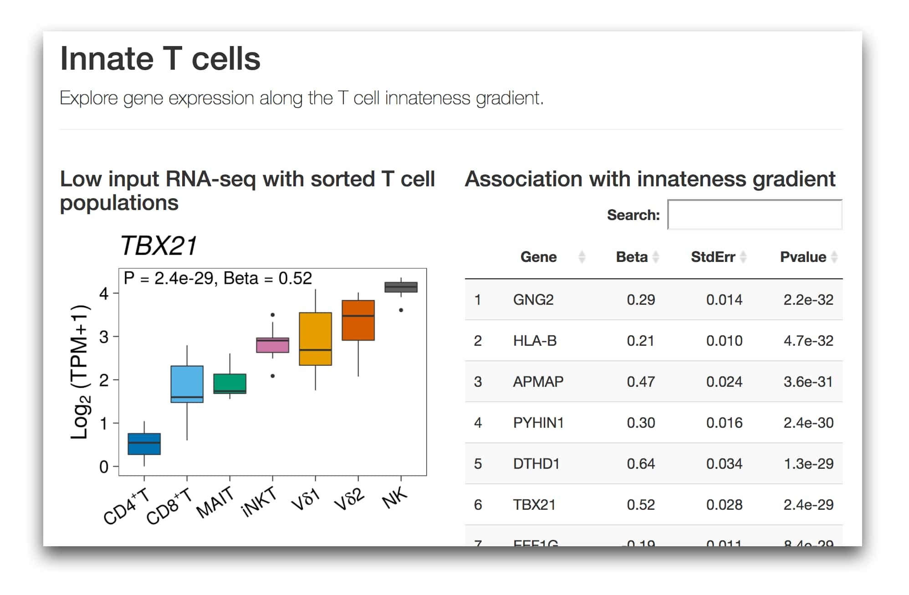

# itcviewer 

A data viewer for the Innate T Cell project.

## :rocket: Explore the data

**<https://immunogenomics.io/itc/>**

  

## :mortar_board: Read the paper

**A genome-wide innateness gradient defines the functional state of human innate T cells.**

Maria Gutierrez-Arcelus, Nikola Teslovich, Alex R Mola, Hyun Kim, Susan Hannes, Kamil Slowikowski, Gerald F. M. Watts, Michael Brenner, Soumya Raychaudhuri, Patrick J. Brennan.

bioRxiv 2018. https://doi.org/10.1101/280370

